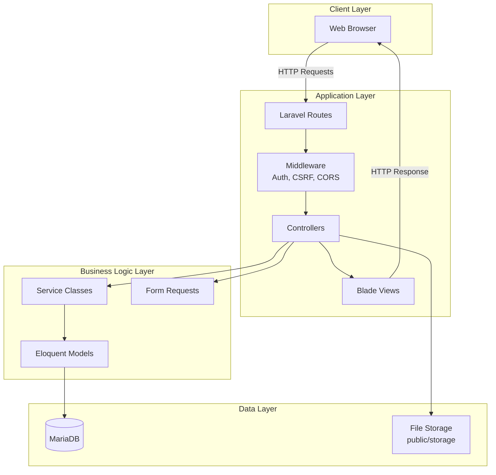
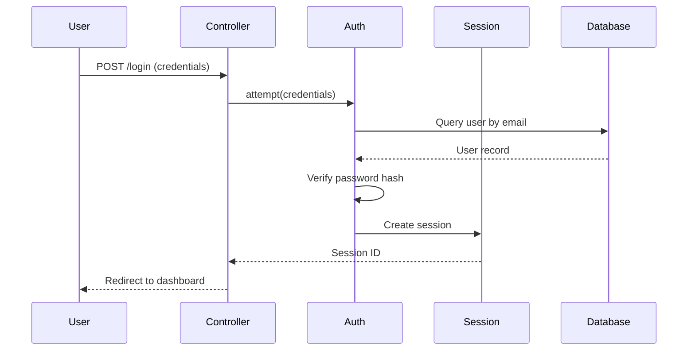
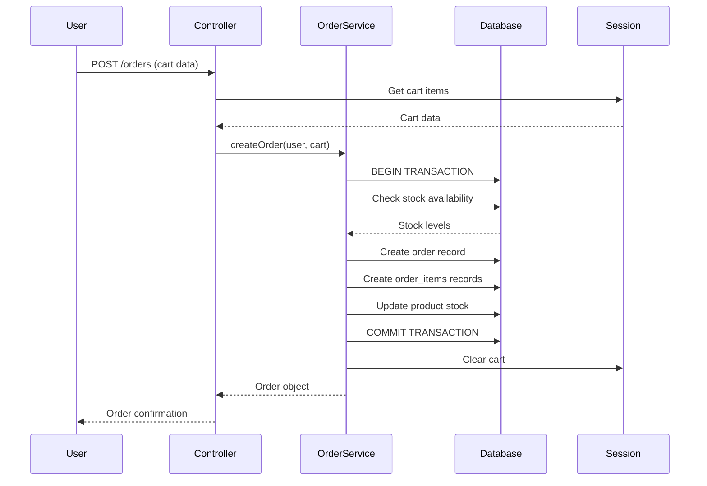
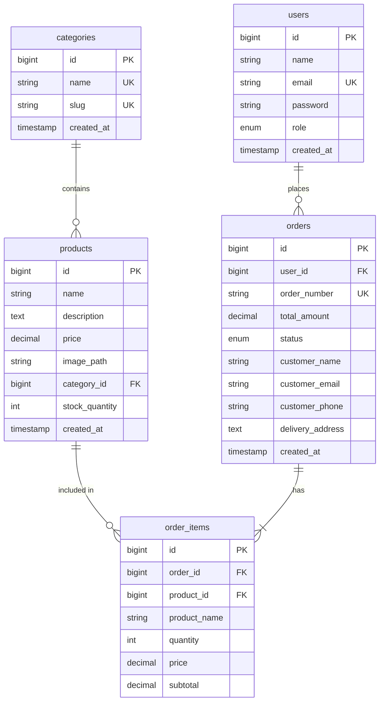

# Technical Design Document: Flower Shop System

## Overview

Система цветочного магазина представляет собой полнофункциональную платформу электронной коммерции, построенную на Laravel framework с использованием MariaDB в качестве базы данных. Система состоит из трех основных компонентов:

1. **RESTful API Backend** - серверная логика на Laravel, обрабатывающая бизнес-логику, аутентификацию и взаимодействие с базой данных
2. **Client Web Application** - клиентское веб-приложение на Blade templates для покупателей
3. **Admin Panel** - административная панель для управления каталогом, заказами и отчетами

Система поддерживает два типа пользователей (User и Administrator) с различными уровнями доступа. Основной функционал включает управление каталогом товаров, обработку заказов, управление корзиной покупок и генерацию отчетов о выручке.

### Technology Stack

- **Backend Framework**: Laravel 12.x
- **Database**: MariaDB (MySQL-compatible)
- **Frontend**: Blade Templates
- **Asset Bundler**: Vite
- **Authentication**: Laravel Sanctum/Session-based auth
- **Testing**: PHPUnit for unit tests, property-based testing library
- **Image Storage**: Laravel Storage (public disk)

## Architecture

### High-Level Architecture

Система следует архитектурному паттерну MVC (Model-View-Controller), который является стандартом для Laravel приложений:



### Layered Architecture


1. **Presentation Layer** (Routes, Controllers, Views)
   - Обрабатывает HTTP запросы и ответы
   - Валидация входных данных через Form Requests
   - Рендеринг Blade templates для клиентской части
   - JSON responses для API endpoints

2. **Business Logic Layer** (Services, Models)
   - Бизнес-логика приложения
   - Eloquent ORM для работы с базой данных
   - Service classes для сложной бизнес-логики (например, обработка заказов)

3. **Data Access Layer** (Models, Database)
   - Eloquent Models как абстракция над таблицами БД
   - Query Builder для сложных запросов
   - Migrations для управления схемой БД

### Authentication Flow



### Order Processing Flow



## Components and Interfaces

### Core Models

#### User Model
```php
class User extends Authenticatable
{
    protected $fillable = ['name', 'email', 'password', 'role'];
    protected $hidden = ['password', 'remember_token'];
    protected $casts = ['email_verified_at' => 'datetime'];
    
    // Relationships
    public function orders(): HasMany;
    
    // Methods
    public function isAdmin(): bool;
}
```

#### Product Model
```php
class Product extends Model
{
    protected $fillable = [
        'name', 'description', 'price', 
        'image_path', 'category_id', 'stock_quantity'
    ];
    protected $casts = [
        'price' => 'decimal:2',
        'stock_quantity' => 'integer'
    ];
    
    // Relationships
    public function category(): BelongsTo;
    public function orderItems(): HasMany;
    
    // Scopes
    public function scopeInStock($query);
    public function scopeByCategory($query, $categoryId);
}
```

#### Category Model
```php
class Category extends Model
{
    protected $fillable = ['name', 'slug'];
    
    // Relationships
    public function products(): HasMany;
    
    // Accessors
    public function getProductCountAttribute(): int;
}
```

#### Order Model
```php
class Order extends Model
{
    protected $fillable = [
        'user_id', 'order_number', 'total_amount', 
        'status', 'customer_name', 'customer_email', 
        'customer_phone', 'delivery_address'
    ];
    protected $casts = [
        'total_amount' => 'decimal:2',
        'created_at' => 'datetime'
    ];
    
    // Relationships
    public function user(): BelongsTo;
    public function orderItems(): HasMany;
    
    // Scopes
    public function scopeCompleted($query);
    public function scopeForUser($query, $userId);
}
```

#### OrderItem Model
```php
class OrderItem extends Model
{
    protected $fillable = [
        'order_id', 'product_id', 'product_name', 
        'quantity', 'price', 'subtotal'
    ];
    protected $casts = [
        'quantity' => 'integer',
        'price' => 'decimal:2',
        'subtotal' => 'decimal:2'
    ];
    
    // Relationships
    public function order(): BelongsTo;
    public function product(): BelongsTo;
}
```

### Service Classes

#### OrderService
```php
class OrderService
{
    /**
     * Create a new order from cart data
     * 
     * @throws InsufficientStockException
     * @throws EmptyCartException
     */
    public function createOrder(User $user, array $cartItems): Order;
    
    /**
     * Update order status
     */
    public function updateOrderStatus(Order $order, string $status): Order;
    
    /**
     * Calculate order total
     */
    public function calculateTotal(array $cartItems): float;
    
    /**
     * Validate stock availability for cart items
     */
    public function validateStock(array $cartItems): bool;
}
```

#### RevenueService
```php
class RevenueService
{
    /**
     * Get revenue report grouped by month
     * 
     * @param int $months Number of months to include (default: 12)
     * @return Collection
     */
    public function getMonthlyRevenue(int $months = 12): Collection;
    
    /**
     * Calculate total revenue for a specific period
     */
    public function calculateRevenue(Carbon $startDate, Carbon $endDate): float;
}
```

#### CartService
```php
class CartService
{
    /**
     * Add product to cart
     */
    public function addItem(int $productId, int $quantity): void;
    
    /**
     * Update item quantity in cart
     * 
     * @throws InsufficientStockException
     */
    public function updateQuantity(int $productId, int $quantity): void;
    
    /**
     * Remove item from cart
     */
    public function removeItem(int $productId): void;
    
    /**
     * Get all cart items with product details
     */
    public function getItems(): array;
    
    /**
     * Calculate cart total
     */
    public function getTotal(): float;
    
    /**
     * Clear cart
     */
    public function clear(): void;
}
```

### Controllers

#### API Controllers

**AuthController**
- `POST /api/register` - Register new user
- `POST /api/login` - Authenticate user
- `POST /api/logout` - Logout user

**ProductController**
- `GET /api/products` - List all products (with filters)
- `GET /api/products/{id}` - Get product details
- `POST /api/products` - Create product (admin only)
- `PUT /api/products/{id}` - Update product (admin only)
- `DELETE /api/products/{id}` - Delete product (admin only)

**CategoryController**
- `GET /api/categories` - List all categories
- `POST /api/categories` - Create category (admin only)
- `PUT /api/categories/{id}` - Update category (admin only)
- `DELETE /api/categories/{id}` - Delete category (admin only)

**OrderController**
- `GET /api/orders` - List user orders (or all for admin)
- `GET /api/orders/{id}` - Get order details
- `POST /api/orders` - Create new order
- `PUT /api/orders/{id}/status` - Update order status (admin only)

**RevenueController**
- `GET /api/admin/revenue` - Get revenue report (admin only)

#### Web Controllers

**HomeController**
- `GET /` - Homepage with product catalog

**ProductWebController**
- `GET /products` - Product listing page
- `GET /products/{id}` - Product detail page

**CartController**
- `GET /cart` - View cart
- `POST /cart/add` - Add to cart
- `PUT /cart/update` - Update cart item
- `DELETE /cart/remove` - Remove from cart

**OrderWebController**
- `GET /orders` - User order history
- `GET /orders/{id}` - Order details
- `POST /orders/checkout` - Create order from cart

**AdminController**
- `GET /admin/dashboard` - Admin dashboard
- `GET /admin/products` - Product management
- `GET /admin/orders` - Order management
- `GET /admin/categories` - Category management
- `GET /admin/revenue` - Revenue reports

### Middleware

1. **Authenticate** - Verify user is logged in
2. **AdminOnly** - Verify user has admin role
3. **VerifyCsrfToken** - CSRF protection for state-changing requests
4. **HandleCors** - CORS headers for API requests
5. **ThrottleRequests** - Rate limiting

### Form Requests (Validation)

**StoreProductRequest**
```php
public function rules(): array
{
    return [
        'name' => 'required|string|max:255',
        'description' => 'required|string',
        'price' => 'required|numeric|min:0.01',
        'category_id' => 'required|exists:categories,id',
        'stock_quantity' => 'required|integer|min:0',
        'image' => 'nullable|image|mimes:jpeg,png,jpg,gif,webp|max:5120'
    ];
}
```

**StoreOrderRequest**
```php
public function rules(): array
{
    return [
        'customer_name' => 'required|string|max:255',
        'customer_email' => 'required|email',
        'customer_phone' => 'required|string|max:20',
        'delivery_address' => 'required|string',
        'cart_items' => 'required|array|min:1',
        'cart_items.*.product_id' => 'required|exists:products,id',
        'cart_items.*.quantity' => 'required|integer|min:1'
    ];
}
```

**UpdateOrderStatusRequest**
```php
public function rules(): array
{
    return [
        'status' => 'required|in:pending,processing,completed,cancelled'
    ];
}
```

## Data Models

### Database Schema

#### users table
```sql
CREATE TABLE users (
    id BIGINT UNSIGNED AUTO_INCREMENT PRIMARY KEY,
    name VARCHAR(255) NOT NULL,
    email VARCHAR(255) NOT NULL UNIQUE,
    email_verified_at TIMESTAMP NULL,
    password VARCHAR(255) NOT NULL,
    role ENUM('user', 'admin') DEFAULT 'user',
    remember_token VARCHAR(100) NULL,
    created_at TIMESTAMP NULL,
    updated_at TIMESTAMP NULL,
    INDEX idx_email (email),
    INDEX idx_role (role)
) ENGINE=InnoDB DEFAULT CHARSET=utf8mb4 COLLATE=utf8mb4_unicode_ci;
```

#### categories table
```sql
CREATE TABLE categories (
    id BIGINT UNSIGNED AUTO_INCREMENT PRIMARY KEY,
    name VARCHAR(255) NOT NULL UNIQUE,
    slug VARCHAR(255) NOT NULL UNIQUE,
    created_at TIMESTAMP NULL,
    updated_at TIMESTAMP NULL,
    INDEX idx_slug (slug)
) ENGINE=InnoDB DEFAULT CHARSET=utf8mb4 COLLATE=utf8mb4_unicode_ci;
```

#### products table
```sql
CREATE TABLE products (
    id BIGINT UNSIGNED AUTO_INCREMENT PRIMARY KEY,
    name VARCHAR(255) NOT NULL,
    description TEXT NOT NULL,
    price DECIMAL(10, 2) NOT NULL,
    image_path VARCHAR(255) NULL,
    category_id BIGINT UNSIGNED NOT NULL,
    stock_quantity INT UNSIGNED NOT NULL DEFAULT 0,
    created_at TIMESTAMP NULL,
    updated_at TIMESTAMP NULL,
    FOREIGN KEY (category_id) REFERENCES categories(id) ON DELETE RESTRICT,
    INDEX idx_category_id (category_id),
    INDEX idx_stock_quantity (stock_quantity),
    INDEX idx_created_at (created_at)
) ENGINE=InnoDB DEFAULT CHARSET=utf8mb4 COLLATE=utf8mb4_unicode_ci;
```

#### orders table
```sql
CREATE TABLE orders (
    id BIGINT UNSIGNED AUTO_INCREMENT PRIMARY KEY,
    user_id BIGINT UNSIGNED NOT NULL,
    order_number VARCHAR(50) NOT NULL UNIQUE,
    total_amount DECIMAL(10, 2) NOT NULL,
    status ENUM('pending', 'processing', 'completed', 'cancelled') DEFAULT 'pending',
    customer_name VARCHAR(255) NOT NULL,
    customer_email VARCHAR(255) NOT NULL,
    customer_phone VARCHAR(20) NOT NULL,
    delivery_address TEXT NOT NULL,
    created_at TIMESTAMP NULL,
    updated_at TIMESTAMP NULL,
    FOREIGN KEY (user_id) REFERENCES users(id) ON DELETE CASCADE,
    INDEX idx_user_id (user_id),
    INDEX idx_order_number (order_number),
    INDEX idx_status (status),
    INDEX idx_created_at (created_at)
) ENGINE=InnoDB DEFAULT CHARSET=utf8mb4 COLLATE=utf8mb4_unicode_ci;
```

#### order_items table
```sql
CREATE TABLE order_items (
    id BIGINT UNSIGNED AUTO_INCREMENT PRIMARY KEY,
    order_id BIGINT UNSIGNED NOT NULL,
    product_id BIGINT UNSIGNED NOT NULL,
    product_name VARCHAR(255) NOT NULL,
    quantity INT UNSIGNED NOT NULL,
    price DECIMAL(10, 2) NOT NULL,
    subtotal DECIMAL(10, 2) NOT NULL,
    created_at TIMESTAMP NULL,
    updated_at TIMESTAMP NULL,
    FOREIGN KEY (order_id) REFERENCES orders(id) ON DELETE CASCADE,
    FOREIGN KEY (product_id) REFERENCES products(id) ON DELETE RESTRICT,
    INDEX idx_order_id (order_id),
    INDEX idx_product_id (product_id)
) ENGINE=InnoDB DEFAULT CHARSET=utf8mb4 COLLATE=utf8mb4_unicode_ci;
```

### Entity Relationship Diagram



### Data Constraints and Business Rules

1. **Price Validation**: Product price must be positive decimal with 2 decimal places
2. **Stock Quantity**: Must be non-negative integer
3. **Order Number**: Auto-generated unique identifier (format: ORD-YYYYMMDD-XXXXX)
4. **Category Deletion**: Cannot delete category if products are assigned to it
5. **Product Deletion**: Soft delete or prevent if included in orders
6. **Order Status Transitions**: 
   - pending → processing → completed
   - pending → cancelled
   - Cannot change status of completed/cancelled orders
7. **Stock Management**: Stock quantity decremented atomically during order creation
8. **Password Storage**: All passwords hashed using bcrypt (Laravel default)


## Correctness Properties

A property is a characteristic or behavior that should hold true across all valid executions of a system-essentially, a formal statement about what the system should do. Properties serve as the bridge between human-readable specifications and machine-verifiable correctness guarantees.

### Property 1: New User Default Role Assignment

*For any* new user registration with valid data, the created user account should have the role set to 'user' (not 'admin').

**Validates: Requirements 1.2**

### Property 2: Valid Credentials Authentication

*For any* user with valid credentials (correct email and password), authentication should succeed and create a valid session.

**Validates: Requirements 1.3**

### Property 3: Invalid Credentials Rejection

*For any* authentication attempt with invalid credentials (wrong password or non-existent email), the system should return an authentication error and not create a session.

**Validates: Requirements 1.4**

### Property 4: Password Hashing

*For any* password stored in the database (during registration or password update), the stored value should be a bcrypt hash, not the plaintext password.

**Validates: Requirements 1.5, 15.6**

### Property 5: Unauthenticated Access Protection

*For any* protected API endpoint, requests without valid authentication should return HTTP 401 Unauthorized status.

**Validates: Requirements 1.6**

### Property 6: Product CRUD Persistence

*For any* product data, when an administrator creates, updates, or deletes a product, the changes should be correctly persisted in the database with all fields (name, description, price, image, category, stock_quantity) intact.

**Validates: Requirements 2.1, 2.2, 2.3**

### Property 7: Product Price Validation

*For any* product creation or update request, if the price is not a positive decimal number (zero, negative, or non-numeric), the API should reject the request with a validation error.

**Validates: Requirements 2.4**

### Property 8: Stock Quantity Validation

*For any* product creation or update request, if the stock quantity is negative or non-integer, the API should reject the request with a validation error.

**Validates: Requirements 2.5**

### Property 9: In-Stock Product Filtering

*For any* product catalog request from a user, the returned products should only include items with stock_quantity > 0.

**Validates: Requirements 2.6**

### Property 10: Product Image Upload and Storage

*For any* valid image file (JPEG, PNG, GIF, WebP) under 5MB, when uploaded for a product, the image should be stored in the public storage directory with a unique filename and the URL should be accessible.

**Validates: Requirements 2.7, 13.1, 13.2, 13.3, 13.4, 13.6**

### Property 11: Product Image Cleanup on Deletion

*For any* product with an associated image, when the product is deleted, the image file should also be removed from storage.

**Validates: Requirements 13.5**

### Property 12: Product Category Filtering

*For any* category ID, when filtering products by that category, all returned products should belong to that category and no products from other categories should be included.

**Validates: Requirements 3.2**

### Property 13: Product Name Search

*For any* search query string, the returned products should have names that contain the search query (case-insensitive), and products not matching should be excluded.

**Validates: Requirements 3.3**

### Property 14: Product Sorting by Creation Date

*For any* product list request (catalog or search results), products should be returned sorted by creation date in descending order (newest first).

**Validates: Requirements 3.5, 6.4**

### Property 15: Cart Item Addition and Storage

*For any* product and quantity, when a user adds an item to the cart, the product ID and quantity should be stored in the user's session and retrievable.

**Validates: Requirements 4.1, 14.2**

### Property 16: Cart Quantity Stock Validation

*For any* cart item quantity update, if the requested quantity exceeds the product's available stock, the system should reject the update with a validation error.

**Validates: Requirements 4.2**

### Property 17: Cart Item Removal

*For any* product in the cart, when the user removes it, the product should no longer appear in the cart items.

**Validates: Requirements 4.3**

### Property 18: Cart Total Calculation

*For any* cart with items, the displayed total should equal the sum of (price × quantity) for all items in the cart.

**Validates: Requirements 4.4**

### Property 19: Order Creation with Complete Data

*For any* valid cart with items and customer information, when an order is created, the order record should contain all required fields (user_id, order_number, total_amount, status='pending', customer details, timestamp) and order_items should be created for each cart item.

**Validates: Requirements 5.1, 5.5**

### Property 20: Stock Reduction on Order Creation

*For any* order created, the stock quantity of each ordered product should be reduced by the ordered quantity atomically.

**Validates: Requirements 5.2**

### Property 21: Insufficient Stock Prevention

*For any* order attempt where any product's requested quantity exceeds available stock, the system should return an error and prevent order creation without modifying stock levels.

**Validates: Requirements 5.3**

### Property 22: Unique Order Number Generation

*For any* set of orders created in the system, all order numbers should be unique (no duplicates).

**Validates: Requirements 5.4**

### Property 23: Empty Cart Validation

*For any* order creation attempt with an empty cart, the system should reject the request with a validation error.

**Validates: Requirements 5.6**

### Property 24: Cart Clearing After Order

*For any* successful order creation, the user's cart should be empty immediately after the order is created.

**Validates: Requirements 5.7**

### Property 25: User Order Isolation

*For any* user requesting their orders, the returned orders should only include orders belonging to that user, and no orders from other users should be included.

**Validates: Requirements 6.1**

### Property 26: Admin Access to All Orders

*For any* administrator requesting orders, the returned list should include orders from all users in the system.

**Validates: Requirements 7.1**

### Property 27: Order Status Update Persistence

*For any* order and valid status value (pending, processing, completed, cancelled), when an administrator updates the order status, the new status should be persisted in the database.

**Validates: Requirements 7.3**

### Property 28: Order Status Validation

*For any* order status update request, if the status is not one of the valid values (pending, processing, completed, cancelled), the system should reject the request with a validation error.

**Validates: Requirements 7.4**

### Property 29: Monthly Revenue Calculation

*For any* set of orders in the database, the revenue report should correctly group completed orders by month and sum their total_amount values.

**Validates: Requirements 8.1**

### Property 30: Completed Orders Only in Revenue

*For any* revenue calculation, only orders with status='completed' should be included in the totals, and orders with other statuses should be excluded.

**Validates: Requirements 8.2**

### Property 31: Revenue Amount Formatting

*For any* revenue amount returned by the API, the value should be formatted as a decimal number with exactly two decimal places.

**Validates: Requirements 8.5**

### Property 32: Category CRUD Operations

*For any* category data, when an administrator creates or updates a category, the changes should be correctly persisted in the database.

**Validates: Requirements 9.1, 9.2**

### Property 33: Category Deletion with Product Check

*For any* category, deletion should succeed only if no products are assigned to it; if products exist in the category, deletion should fail with an error.

**Validates: Requirements 9.3**

### Property 34: Category Name Uniqueness

*For any* category creation or update attempt, if the category name already exists in the database, the system should reject the request with a validation error.

**Validates: Requirements 9.4**

### Property 35: Category Product Count

*For any* category in the system, when retrieving categories, the product count should accurately reflect the number of products assigned to that category.

**Validates: Requirements 9.5**

### Property 36: JSON Response Format

*For any* API endpoint response, the content should be valid JSON format that can be parsed without errors.

**Validates: Requirements 10.2**

### Property 37: HTTP Status Code Correctness

*For any* API request, the response should use appropriate HTTP status codes: 200 for successful retrieval, 201 for successful creation, 400 for validation errors, 401 for authentication errors, 404 for not found resources.

**Validates: Requirements 10.3**

### Property 38: Error Message Format

*For any* API error response, the response should be in JSON format and include descriptive error messages with field-specific details for validation errors.

**Validates: Requirements 10.4, 10.6**

### Property 39: Foreign Key Constraint Enforcement

*For any* database operation attempting to create a record with an invalid foreign key (e.g., product with non-existent category_id), the database should reject the operation and enforce referential integrity.

**Validates: Requirements 11.3**

### Property 40: Session Clearing on Logout

*For any* authenticated user, when they log out, their session data (including cart) should be completely cleared.

**Validates: Requirements 14.3**

### Property 41: SQL Injection Prevention

*For any* user input containing SQL injection attempts (e.g., SQL keywords, special characters), the system should properly escape or reject the input, preventing execution of malicious SQL.

**Validates: Requirements 15.2**

### Property 42: XSS Attack Prevention

*For any* user input containing XSS payloads (e.g., script tags, JavaScript), when the data is displayed in views, it should be properly escaped to prevent script execution.

**Validates: Requirements 15.3**

### Property 43: CSRF Token Protection

*For any* state-changing request (POST, PUT, DELETE), if the request does not include a valid CSRF token, the system should reject the request with an error.

**Validates: Requirements 15.4**


## Error Handling

### Error Response Format

All API errors should return consistent JSON responses:

```json
{
    "message": "Human-readable error message",
    "errors": {
        "field_name": ["Specific validation error for this field"]
    }
}
```

### Error Categories

#### 1. Validation Errors (HTTP 400)

**Triggers:**
- Invalid input data (negative prices, invalid email format)
- Missing required fields
- Data type mismatches
- Business rule violations (e.g., quantity exceeds stock)

**Handling:**
- Use Laravel Form Request validation
- Return field-specific error messages
- Maintain current state (no partial updates)

**Example:**
```php
{
    "message": "The given data was invalid.",
    "errors": {
        "price": ["The price must be at least 0.01."],
        "stock_quantity": ["The stock quantity must be an integer."]
    }
}
```

#### 2. Authentication Errors (HTTP 401)

**Triggers:**
- Invalid credentials
- Missing authentication token
- Expired session
- Accessing protected routes without authentication

**Handling:**
- Clear error messages without revealing security details
- Redirect to login page for web routes
- Return 401 status for API routes

**Example:**
```php
{
    "message": "Unauthenticated."
}
```

#### 3. Authorization Errors (HTTP 403)

**Triggers:**
- Non-admin user attempting admin operations
- User attempting to access another user's orders

**Handling:**
- Use Laravel policies and gates
- Return generic "Forbidden" message

**Example:**
```php
{
    "message": "This action is unauthorized."
}
```

#### 4. Resource Not Found (HTTP 404)

**Triggers:**
- Requesting non-existent product, order, or category
- Invalid ID in URL parameters

**Handling:**
- Use Laravel's `findOrFail()` methods
- Return clear "not found" messages

**Example:**
```php
{
    "message": "Product not found."
}
```

#### 5. Business Logic Errors (HTTP 422)

**Triggers:**
- Insufficient stock for order
- Attempting to delete category with products
- Empty cart during checkout
- Duplicate category name

**Handling:**
- Validate business rules before database operations
- Use database transactions for multi-step operations
- Rollback on failure

**Example:**
```php
{
    "message": "Cannot complete order. Insufficient stock for product: Rose Bouquet",
    "errors": {
        "products": ["Product ID 5 has only 3 items in stock, but 5 were requested."]
    }
}
```

#### 6. Server Errors (HTTP 500)

**Triggers:**
- Database connection failures
- File system errors
- Unexpected exceptions

**Handling:**
- Log detailed error information
- Return generic error message to client (don't expose internals)
- Use Laravel's exception handler

**Example:**
```php
{
    "message": "An error occurred while processing your request. Please try again later."
}
```

### Exception Handling Strategy

#### Custom Exceptions

```php
// app/Exceptions/InsufficientStockException.php
class InsufficientStockException extends Exception
{
    public function __construct(Product $product, int $requested, int $available)
    {
        $message = "Insufficient stock for {$product->name}. Requested: {$requested}, Available: {$available}";
        parent::__construct($message);
    }
    
    public function render($request)
    {
        return response()->json([
            'message' => $this->getMessage()
        ], 422);
    }
}

// app/Exceptions/EmptyCartException.php
class EmptyCartException extends Exception
{
    public function render($request)
    {
        return response()->json([
            'message' => 'Cannot create order with empty cart.'
        ], 422);
    }
}
```

#### Global Exception Handler

```php
// app/Exceptions/Handler.php
public function register()
{
    $this->renderable(function (ModelNotFoundException $e, $request) {
        if ($request->expectsJson()) {
            return response()->json([
                'message' => 'Resource not found.'
            ], 404);
        }
    });
    
    $this->renderable(function (AuthenticationException $e, $request) {
        if ($request->expectsJson()) {
            return response()->json([
                'message' => 'Unauthenticated.'
            ], 401);
        }
        return redirect()->route('login');
    });
}
```

### Database Transaction Handling

For operations that modify multiple tables (e.g., order creation):

```php
DB::beginTransaction();
try {
    // Create order
    $order = Order::create([...]);
    
    // Create order items
    foreach ($cartItems as $item) {
        OrderItem::create([...]);
        
        // Update stock
        $product = Product::lockForUpdate()->find($item['product_id']);
        if ($product->stock_quantity < $item['quantity']) {
            throw new InsufficientStockException($product, $item['quantity'], $product->stock_quantity);
        }
        $product->decrement('stock_quantity', $item['quantity']);
    }
    
    DB::commit();
    return $order;
} catch (Exception $e) {
    DB::rollBack();
    throw $e;
}
```

### Logging Strategy

- **Error Level**: All exceptions, failed authentication attempts, authorization failures
- **Warning Level**: Business rule violations, stock warnings
- **Info Level**: Successful orders, admin actions
- **Debug Level**: Query logs, detailed request/response data (development only)

```php
Log::error('Order creation failed', [
    'user_id' => $user->id,
    'cart_items' => $cartItems,
    'exception' => $e->getMessage()
]);
```

## Testing Strategy

### Overview

The testing strategy employs a dual approach combining unit tests and property-based tests to ensure comprehensive coverage and correctness of the Flower Shop System.

### Testing Pyramid

```
        /\
       /  \
      / E2E \          (Few) - End-to-end tests for critical user flows
     /______\
    /        \
   / Property \        (Many) - Property-based tests for universal rules
  /___________\
 /             \
/   Unit Tests  \     (Most) - Unit tests for specific examples and edge cases
/_______________\
```

### Unit Testing

Unit tests focus on specific examples, edge cases, and integration points between components.

#### Scope

- **Models**: Test relationships, scopes, accessors, mutators
- **Controllers**: Test request handling, response format, status codes
- **Services**: Test business logic methods with specific inputs
- **Validation**: Test Form Request validation rules
- **Middleware**: Test authentication, authorization, CSRF protection

#### Tools

- **PHPUnit**: Laravel's default testing framework
- **Laravel Testing Helpers**: `actingAs()`, `assertDatabaseHas()`, `assertJson()`
- **Factory Pattern**: Generate test data using Laravel factories

#### Example Unit Tests

```php
// tests/Unit/Models/ProductTest.php
class ProductTest extends TestCase
{
    public function test_in_stock_scope_filters_products_with_zero_stock()
    {
        Product::factory()->create(['stock_quantity' => 0]);
        Product::factory()->create(['stock_quantity' => 5]);
        
        $inStockProducts = Product::inStock()->get();
        
        $this->assertCount(1, $inStockProducts);
    }
    
    public function test_product_belongs_to_category()
    {
        $product = Product::factory()->create();
        
        $this->assertInstanceOf(Category::class, $product->category);
    }
}

// tests/Unit/Services/CartServiceTest.php
class CartServiceTest extends TestCase
{
    public function test_add_item_stores_product_in_session()
    {
        $product = Product::factory()->create(['stock_quantity' => 10]);
        $cartService = new CartService();
        
        $cartService->addItem($product->id, 2);
        
        $items = $cartService->getItems();
        $this->assertCount(1, $items);
        $this->assertEquals(2, $items[0]['quantity']);
    }
    
    public function test_calculate_total_returns_correct_sum()
    {
        $product1 = Product::factory()->create(['price' => 10.50]);
        $product2 = Product::factory()->create(['price' => 15.75]);
        $cartService = new CartService();
        
        $cartService->addItem($product1->id, 2); // 21.00
        $cartService->addItem($product2->id, 1); // 15.75
        
        $this->assertEquals(36.75, $cartService->getTotal());
    }
}

// tests/Feature/OrderControllerTest.php
class OrderControllerTest extends TestCase
{
    public function test_user_can_only_see_their_own_orders()
    {
        $user1 = User::factory()->create();
        $user2 = User::factory()->create();
        $order1 = Order::factory()->create(['user_id' => $user1->id]);
        $order2 = Order::factory()->create(['user_id' => $user2->id]);
        
        $response = $this->actingAs($user1)->getJson('/api/orders');
        
        $response->assertStatus(200)
                 ->assertJsonCount(1, 'data')
                 ->assertJsonFragment(['id' => $order1->id])
                 ->assertJsonMissing(['id' => $order2->id]);
    }
}
```

### Property-Based Testing

Property-based tests verify universal properties across many randomly generated inputs, ensuring correctness for all valid scenarios.

#### Scope

- **Universal Rules**: Properties that must hold for all inputs
- **Invariants**: Conditions that remain true across operations
- **Round-trip Properties**: Serialization/deserialization, CRUD operations
- **Business Rules**: Stock management, price calculations, access control

#### Tools

We will use **Pest PHP with Pest Property Plugin** for property-based testing in Laravel:

```bash
composer require pestphp/pest --dev
composer require pestphp/pest-plugin-laravel --dev
composer require pestphp/pest-plugin-faker --dev
```

#### Configuration

- **Minimum 100 iterations** per property test (configured in pest.php)
- Each test tagged with: `Feature: flower-shop-system, Property {number}: {property_text}`
- Use Laravel factories for generating random test data

#### Example Property Tests

```php
// tests/Property/AuthenticationPropertyTest.php

use function Pest\Laravel\postJson;

/**
 * Feature: flower-shop-system, Property 2: Valid Credentials Authentication
 * 
 * For any user with valid credentials, authentication should succeed
 */
test('valid credentials always authenticate successfully', function () {
    $password = fake()->password(8);
    $user = User::factory()->create(['password' => bcrypt($password)]);
    
    $response = postJson('/api/login', [
        'email' => $user->email,
        'password' => $password
    ]);
    
    $response->assertStatus(200);
    expect(session()->has('user_id'))->toBeTrue();
})->repeat(100);

/**
 * Feature: flower-shop-system, Property 4: Password Hashing
 * 
 * For any password stored in database, it should be hashed
 */
test('all stored passwords are hashed with bcrypt', function () {
    $plainPassword = fake()->password(8, 20);
    
    $user = User::factory()->create(['password' => bcrypt($plainPassword)]);
    
    $storedPassword = DB::table('users')->where('id', $user->id)->value('password');
    expect($storedPassword)->not->toBe($plainPassword);
    expect(Hash::check($plainPassword, $storedPassword))->toBeTrue();
})->repeat(100);

// tests/Property/ProductPropertyTest.php

/**
 * Feature: flower-shop-system, Property 7: Product Price Validation
 * 
 * For any non-positive price, product creation should be rejected
 */
test('negative or zero prices are always rejected', function () {
    $admin = User::factory()->admin()->create();
    $invalidPrice = fake()->randomElement([0, -0.01, -10.50, -100]);
    
    $response = actingAs($admin)->postJson('/api/products', [
        'name' => fake()->words(3, true),
        'description' => fake()->paragraph(),
        'price' => $invalidPrice,
        'category_id' => Category::factory()->create()->id,
        'stock_quantity' => fake()->numberBetween(0, 100)
    ]);
    
    $response->assertStatus(422);
    $response->assertJsonValidationErrors('price');
})->repeat(100);

/**
 * Feature: flower-shop-system, Property 9: In-Stock Product Filtering
 * 
 * For any product catalog request, only products with stock > 0 are returned
 */
test('product catalog only returns in-stock items', function () {
    // Create mix of in-stock and out-of-stock products
    $inStockCount = fake()->numberBetween(1, 10);
    $outOfStockCount = fake()->numberBetween(1, 10);
    
    Product::factory()->count($inStockCount)->create(['stock_quantity' => fake()->numberBetween(1, 100)]);
    Product::factory()->count($outOfStockCount)->create(['stock_quantity' => 0]);
    
    $response = getJson('/api/products');
    
    $response->assertStatus(200);
    $products = $response->json('data');
    
    expect(count($products))->toBe($inStockCount);
    foreach ($products as $product) {
        expect($product['stock_quantity'])->toBeGreaterThan(0);
    }
})->repeat(100);

// tests/Property/OrderPropertyTest.php

/**
 * Feature: flower-shop-system, Property 20: Stock Reduction on Order Creation
 * 
 * For any order created, stock should be reduced by ordered quantity
 */
test('creating order reduces product stock by ordered quantity', function () {
    $user = User::factory()->create();
    $product = Product::factory()->create(['stock_quantity' => fake()->numberBetween(10, 100)]);
    $orderQuantity = fake()->numberBetween(1, 5);
    $initialStock = $product->stock_quantity;
    
    $cartService = new CartService();
    $cartService->addItem($product->id, $orderQuantity);
    
    $orderService = new OrderService();
    $order = $orderService->createOrder($user, $cartService->getItems());
    
    $product->refresh();
    expect($product->stock_quantity)->toBe($initialStock - $orderQuantity);
})->repeat(100);

/**
 * Feature: flower-shop-system, Property 22: Unique Order Number Generation
 * 
 * For any set of orders, all order numbers should be unique
 */
test('all generated order numbers are unique', function () {
    $orderCount = fake()->numberBetween(5, 20);
    $orderNumbers = [];
    
    for ($i = 0; $i < $orderCount; $i++) {
        $user = User::factory()->create();
        $product = Product::factory()->create(['stock_quantity' => 100]);
        
        $cartService = new CartService();
        $cartService->addItem($product->id, 1);
        
        $orderService = new OrderService();
        $order = $orderService->createOrder($user, $cartService->getItems());
        
        $orderNumbers[] = $order->order_number;
    }
    
    $uniqueOrderNumbers = array_unique($orderNumbers);
    expect(count($uniqueOrderNumbers))->toBe($orderCount);
})->repeat(100);

// tests/Property/CartPropertyTest.php

/**
 * Feature: flower-shop-system, Property 18: Cart Total Calculation
 * 
 * For any cart with items, total should equal sum of (price × quantity)
 */
test('cart total always equals sum of item subtotals', function () {
    $cartService = new CartService();
    $itemCount = fake()->numberBetween(1, 10);
    $expectedTotal = 0;
    
    for ($i = 0; $i < $itemCount; $i++) {
        $price = fake()->randomFloat(2, 1, 100);
        $quantity = fake()->numberBetween(1, 10);
        $product = Product::factory()->create([
            'price' => $price,
            'stock_quantity' => 100
        ]);
        
        $cartService->addItem($product->id, $quantity);
        $expectedTotal += $price * $quantity;
    }
    
    $actualTotal = $cartService->getTotal();
    expect($actualTotal)->toBe(round($expectedTotal, 2));
})->repeat(100);

// tests/Property/SecurityPropertyTest.php

/**
 * Feature: flower-shop-system, Property 41: SQL Injection Prevention
 * 
 * For any input with SQL injection attempts, system should prevent execution
 */
test('sql injection attempts are prevented', function () {
    $maliciousInputs = [
        "'; DROP TABLE users; --",
        "1' OR '1'='1",
        "admin'--",
        "' UNION SELECT * FROM users--"
    ];
    
    $maliciousInput = fake()->randomElement($maliciousInputs);
    
    $response = postJson('/api/products', [
        'name' => $maliciousInput,
        'description' => fake()->paragraph(),
        'price' => 10.50,
        'category_id' => 999999,
        'stock_quantity' => 10
    ]);
    
    // Should either validate/reject or safely escape
    // Database should still be intact
    expect(Schema::hasTable('users'))->toBeTrue();
    expect(Schema::hasTable('products'))->toBeTrue();
})->repeat(100);
```

### Test Organization

```
tests/
├── Feature/              # Integration tests for HTTP endpoints
│   ├── AuthenticationTest.php
│   ├── ProductControllerTest.php
│   ├── OrderControllerTest.php
│   └── AdminControllerTest.php
├── Unit/                 # Unit tests for isolated components
│   ├── Models/
│   │   ├── ProductTest.php
│   │   ├── OrderTest.php
│   │   └── CategoryTest.php
│   └── Services/
│       ├── CartServiceTest.php
│       ├── OrderServiceTest.php
│       └── RevenueServiceTest.php
└── Property/             # Property-based tests
    ├── AuthenticationPropertyTest.php
    ├── ProductPropertyTest.php
    ├── OrderPropertyTest.php
    ├── CartPropertyTest.php
    ├── CategoryPropertyTest.php
    └── SecurityPropertyTest.php
```

### Testing Best Practices

1. **Use Database Transactions**: Wrap tests in transactions to avoid test pollution
   ```php
   use Illuminate\Foundation\Testing\RefreshDatabase;
   uses(RefreshDatabase::class);
   ```

2. **Factory Usage**: Use factories for all test data generation
   ```php
   Product::factory()->count(10)->create();
   ```

3. **Avoid Over-Mocking**: Test real integrations where possible, mock only external services

4. **Test Isolation**: Each test should be independent and not rely on other tests

5. **Clear Assertions**: Use descriptive assertion messages
   ```php
   $this->assertEquals(5, $count, 'Cart should contain 5 items after adding products');
   ```

6. **Coverage Goals**:
   - Unit tests: 80%+ code coverage
   - Property tests: All correctness properties implemented
   - Feature tests: All critical user flows covered

### Continuous Integration

Tests should run automatically on:
- Every commit (pre-commit hook)
- Pull requests (CI pipeline)
- Before deployment (staging environment)

```yaml
# .github/workflows/tests.yml
name: Tests
on: [push, pull_request]
jobs:
  test:
    runs-on: ubuntu-latest
    steps:
      - uses: actions/checkout@v2
      - name: Setup PHP
        uses: shivammathur/setup-php@v2
        with:
          php-version: '8.2'
      - name: Install Dependencies
        run: composer install
      - name: Run Unit Tests
        run: php artisan test --testsuite=Unit
      - name: Run Property Tests
        run: php artisan test --testsuite=Property
      - name: Run Feature Tests
        run: php artisan test --testsuite=Feature
```

### Manual Testing Checklist

In addition to automated tests, manual testing should cover:

- [ ] Responsive design on mobile devices
- [ ] Image upload and display quality
- [ ] Browser compatibility (Chrome, Firefox, Safari, Edge)
- [ ] Accessibility (keyboard navigation, screen readers)
- [ ] Performance under load (concurrent users, large catalogs)
- [ ] Email notifications (if implemented)
- [ ] Payment gateway integration (if implemented)

